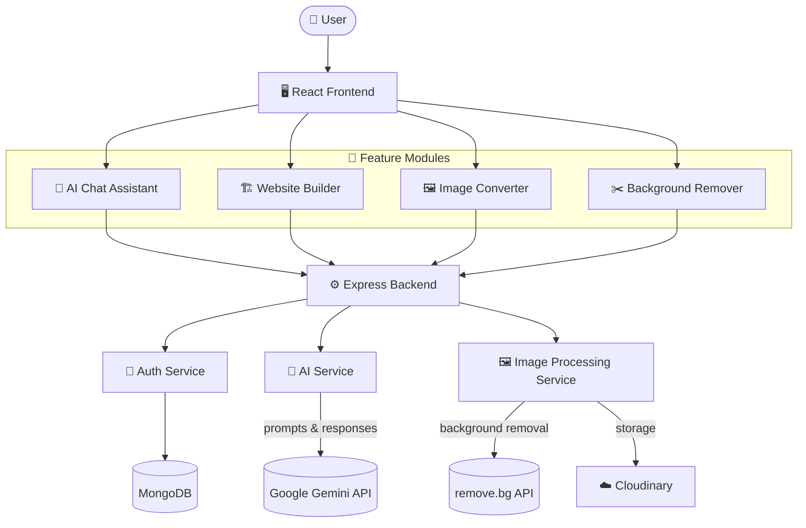
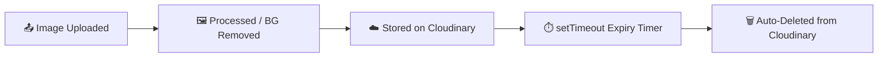

<div align="center">


<br/>


<br/>

<a href="https://logixai-two.vercel.app/">
  
</a>
<a href="https://github.com/ayushi48/Logixai">
  
</a>
<a href="https://ayushikumari.me/">
  
</a>

<br/><br/>


</div>

<br/>

## 📌 Overview

> **LogixAI** is a full-stack AI platform that unifies conversational AI, intelligent website generation, and advanced image processing — all in a single, seamless experience.

A multi-tool workspace where an AI chat assistant, an AI website builder, and an AI-powered image toolkit (converter + background remover) live behind one clean, glassmorphism-styled interface — backed by Google Gemini for the language and reasoning layer.

<br/>

## 🧭 Table of Contents

- [🔗 Quick Links](#-quick-links)
- [✨ Features](#-features)
- [📊 Core Modules](#-core-modules)
- [🛠️ Tech Stack](#️-tech-stack)
- [🎨 Design Language](#-design-language)
- [🏗️ System Architecture](#️-system-architecture)
- [🗂️ Project Structure](#️-project-structure)
- [🚀 Getting Started](#-getting-started)
- [🌟 Project Highlights](#-project-highlights)
- [👩‍💻 Author](#-author)

<br/>

## 🔗 Quick Links

<div align="center">

| 🚀 Live Demo | 📦 Repository | 👤 Portfolio |
|:---:|:---:|:---:|
| [Try LogixAI →](https://logixai-two.vercel.app/) | [View Code →](https://github.com/ayushi48/Logixai) | [See Work →](https://ayushikumari.me/) |

</div>

<br/>

## ✨ Features

<table>
<tr>
<td width="50%" valign="top">

### 🤖 AI Question Answering
Conversational AI assistant powered by Google Gemini. Context-aware, accurate, and instant — built to assist every step of a user's workflow.

</td>
<td width="50%" valign="top">

### 🏗️ AI Website Builder
Generate fully functional, responsive websites with HTML, CSS, and JavaScript from a plain-language description — no manual coding required.

</td>
</tr>
<tr>
<td width="50%" valign="top">

### 🖼️ AI Image Conversion
Convert images to **PNG, JPG, JPEG, WEBP**, or **AVIF** with AI-enhanced quality — outputs optimized for web, mobile, and social media.

</td>
<td width="50%" valign="top">

### ✂️ AI Background Remover
Clean, professional background removal via **remove.bg**, wired into a lightweight upload → process → auto-expire pipeline.

</td>
</tr>
</table>

<br/>

## 📊 Core Modules

| Module | Description |
|---|---|
| 🤖 AI Chat Assistant | Intelligent conversational AI for Q&A, content generation, and problem-solving |
| 🌐 AI Website Builder | Generates responsive websites from user prompts (HTML/CSS/JS) |
| 🖼️ Image Converter | Converts images between PNG, JPG, JPEG, WEBP, and AVIF |
| ✂️ Background Remover | Removes image backgrounds via remove.bg integration |
| 🔐 Authentication System | Secure login, signup, token management, protected routes |
| 📁 Upload Manager | Handles image uploads, validation, and processing |
| ⚡ REST API Services | Backend APIs for AI interactions and image processing |
| 📱 Responsive Interface | Optimized experience across desktop, tablet, and mobile |

<br/>

## 🛠️ Tech Stack

<div align="center">


</div>

<br/>

<div align="center">

| Layer | Technology |
|:--|:--|
| 🎨 **Frontend** | React.js · Vite · Tailwind CSS |
| ⚙️ **Backend** | Node.js · Express.js · REST APIs |
| 🗄️ **Database** | MongoDB |
| 🧠 **AI / LLM** | Google Gemini API |
| 🖼️ **Image Pipeline** | remove.bg (background removal) · Cloudinary (storage) |
| ☁️ **Deployment** | Vercel |

</div>

<br/>

## 🎨 Design Language

LogixAI's UI leans into a dark, glassmorphism aesthetic rather than a generic admin-panel look:

- 🌌 Dark theme with radial **purple/pink gradient orbs** in the background
- 🧊 Glassmorphism cards with backdrop blur across login/signup, the landing page, and the dashboard
- 🔤 Typography: **Syne** for display headings, **DM Sans** for body text
- 🎨 Accent palette: Purple `#A855F7` · Pink `#EC4899`
- 📱 Compact sidebar on desktop, collapsible mobile nav

<br/>

## 🏗️ System Architecture



**Upload → Process → Auto-Expire Pipeline**

Rather than running a Redis/Bull queue for cleanup, Cloudinary uploads are cleared with a lightweight `setTimeout`-based expiry — a simpler ops footprint for a workload that doesn't need a full job queue.



<br/>

## 🗂️ Project Structure

```
Logixai/
└── Logixaii/
    ├── backend/
    │   ├── bgremover/           # Background removal module
    │   ├── imgconverter/        # Image conversion module
    │   ├── web/                 # Website builder module
    │   ├── controllers/         # Route handler logic
    │   ├── middleware/          # Auth & request middleware
    │   ├── models/              # Mongoose schemas
    │   ├── routes/              # API route definitions
    │   ├── services/            # Gemini / AI service layer
    │   ├── config/              # App & service configuration
    │   ├── uploads/             # Temporary upload storage
    │   ├── server.js            # Entry point
    │   └── package.json
    │
    └── frontend/
        ├── public/
        ├── src/
        ├── index.html
        ├── eslint.config.js
        ├── tailwind.config.js
        ├── vercel.json
        ├── vite.config.js
        └── package.json
```

<br/>

## 🚀 Getting Started

### 1️⃣ Clone the repository
```bash
git clone https://github.com/ayushi48/Logixai.git
cd Logixai/Logixaii
```

### 2️⃣ Install dependencies

<details>
<summary><b>Backend</b></summary>

```bash
cd backend
npm install
```
</details>

<details>
<summary><b>Frontend</b></summary>

```bash
cd frontend
npm install
```
</details>

### 3️⃣ Configure environment variables

Create a `.env` file inside `backend/`:

```env
PORT=5000
MONGO_URI=your_mongodb_connection
JWT_SECRET=your_secret_key
GEMINI_API_KEY=your_gemini_api_key
REMOVE_BG_API_KEY=your_remove_bg_api_key
CLOUDINARY_CLOUD_NAME=your_cloudinary_name
CLOUDINARY_API_KEY=your_cloudinary_key
CLOUDINARY_API_SECRET=your_cloudinary_secret
```

### 4️⃣ Run the app

<details>
<summary><b>Start Backend</b></summary>

```bash
cd backend
npm start
```
</details>

<details>
<summary><b>Start Frontend</b></summary>

```bash
cd frontend
npm run dev
```
</details>

<br/>

## 🌟 Project Highlights

- 🔗 **Unified Platform** — AI chat, website building, image conversion, and background removal in one place
- 🧠 **LLM-Powered** — context-aware AI responses via Google Gemini
- ⚡ **Lightweight Ops** — `setTimeout`-based Cloudinary cleanup instead of a Redis/Bull queue
- 🧊 **Distinctive UI** — glassmorphism cards, gradient orbs, and a Syne/DM Sans type system
- 📱 **Fully Responsive** — desktop, tablet, and mobile, down to a compact mobile nav

<br/>

## 👩‍💻 Author

<div align="center">


*Full-Stack MERN Developer • AI Enthusiast • React Developer*

<br/>

<a href="https://github.com/ayushi48">
  
</a>
<a href="https://www.linkedin.com/in/ayushi-kumari48/">
  
</a>
<a href="mailto:ayushikr2016@gmail.com">
  
</a>
<a href="https://ayushikumari.me/">
  
</a>

</div>

<br/>

<div align="center">

*Built with ❤️ using React, Node.js & Google Gemini*


</div>
